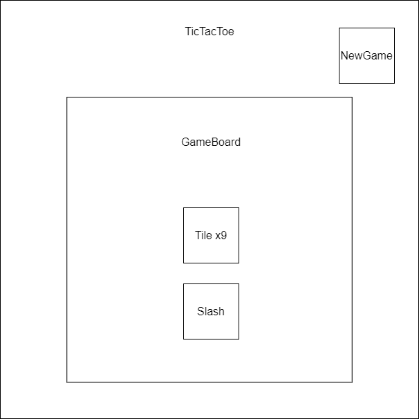

# TicTacToe
The **TicTacToe** component handles the main TicTacToe game.
This component contains other components, including: 
- **GameBoard**
  - **Tile**
- **NewGame**
- **Slash**
#

#

## Components
### Title
The **Title** component is the title of the game.

### GameBoard
The **GameBoard** component contains all pieces of TicTacToe.
[Game Board](./GameBoard.md)

### NewGame
The **NewGame** component starts a new game.
[NewGame](./NewGame.md)

### Slash
The **Slash** component marks a winner.
[Slash](./Slash.md)

## Members
### m_is_player1
The current player (true if 1, false if 2)
> Type: bool

## Methods
### setPlayer1
Sets the current player
> Args: bool